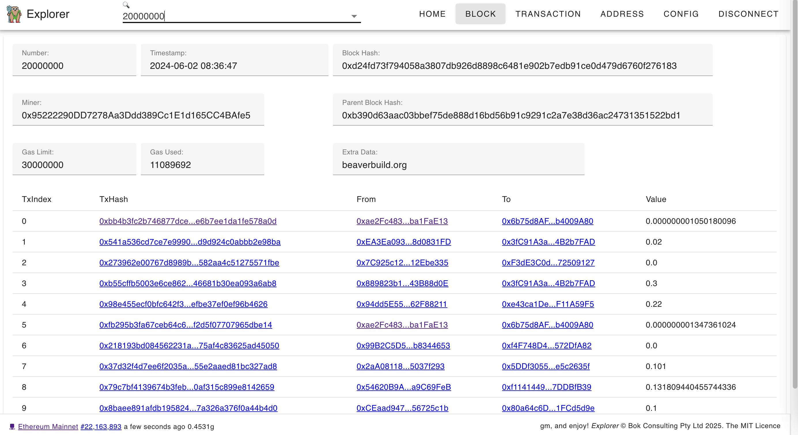
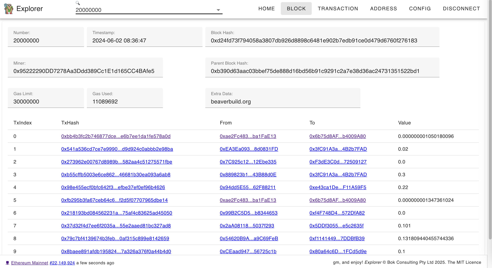
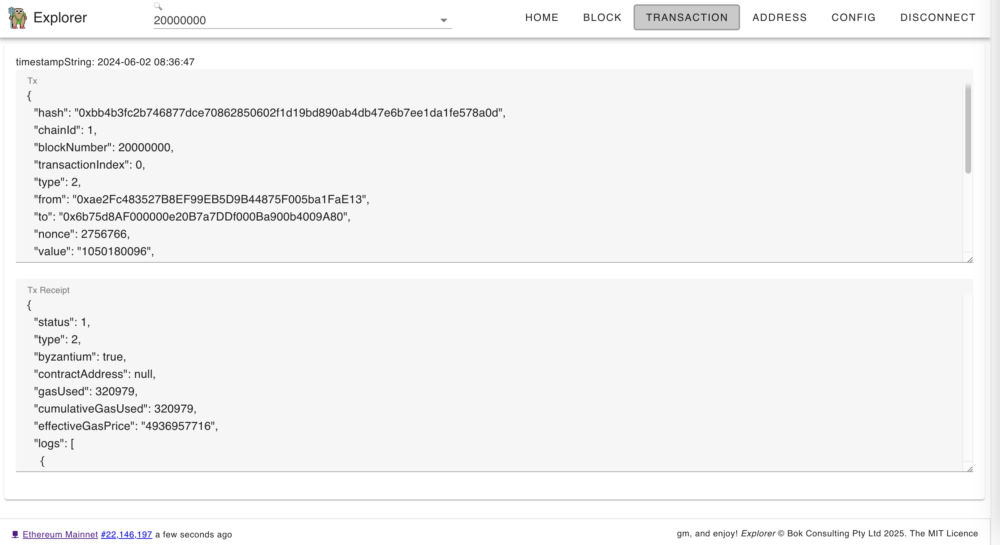
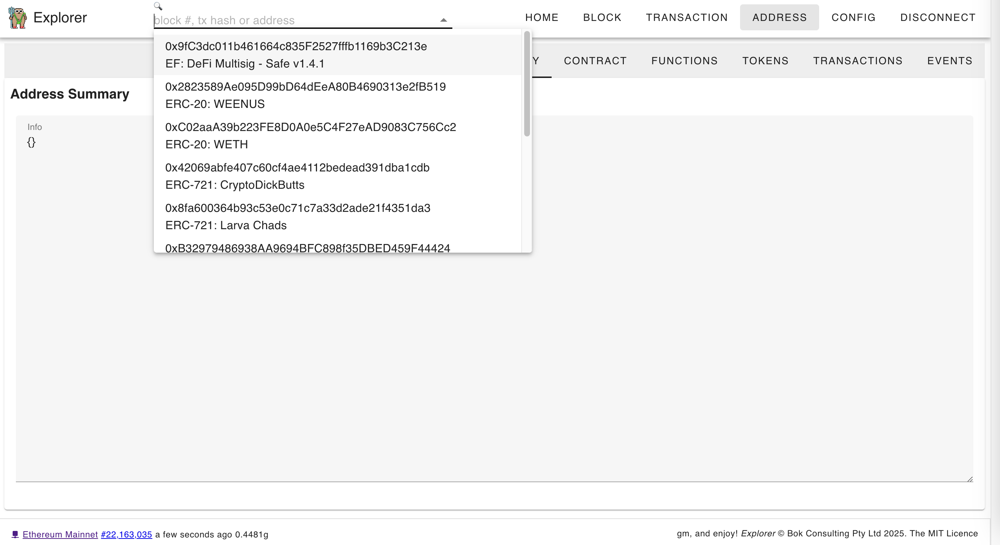
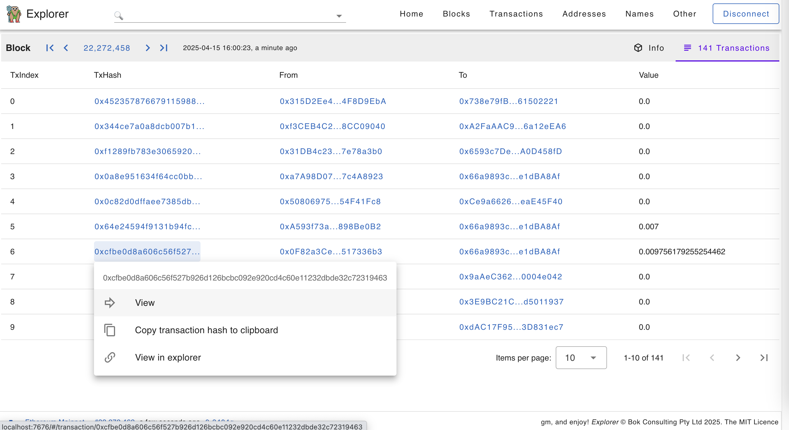
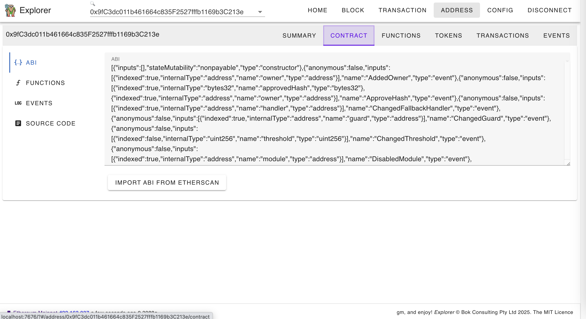
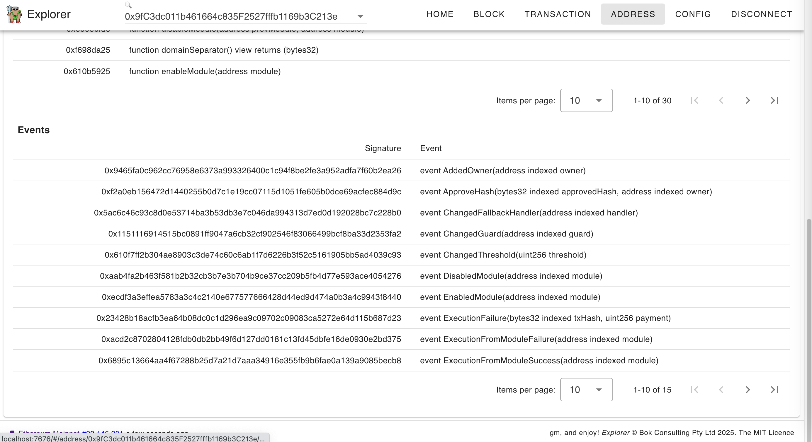

# Ethereum Explorer (WIP)

Web3 dapp: https://bokkypoobah.github.io/Explorer/ connected to Ethereum Mainnet (WIP)

 

---

### Sample Screens

<kbd></kbd>

<kbd></kbd>

<kbd></kbd>

<kbd></kbd>

<kbd></kbd>

<kbd></kbd>

<kbd></kbd>

 

 

Enjoy!

(c) BokkyPooBah / Bok Consulting Pty Ltd 2025. The MIT License
