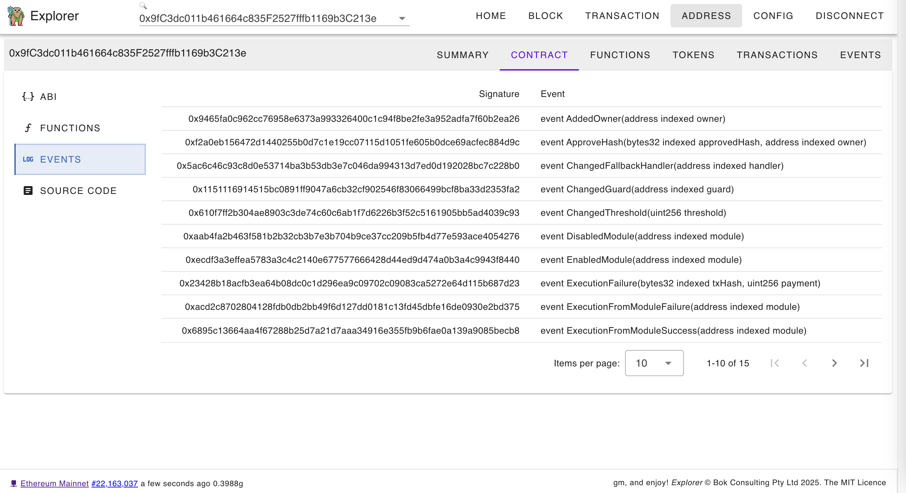

# Ethereum Explorer (WIP)

Web3 dapp: https://bokkypoobah.github.io/Explorer/ connected to Ethereum Mainnet (WIP)

 

---

### Sample Screens

<kbd></kbd>

<kbd></kbd>

<kbd></kbd>

<kbd></kbd>

<kbd></kbd>

<kbd></kbd>

<kbd></kbd>

<kbd></kbd>

 

---

### Deployed Contracts For Testing

* Mar 25 2025 - Deployed [deployed_contracts/TestExplorer_v0.8.0a_Sepolia_0xFD8609Efb8A768A8ef559Cba94Ec21E7Bf8801c4.sol](deployed_contracts/TestExplorer_v0.8.0a_Sepolia_0xFD8609Efb8A768A8ef559Cba94Ec21E7Bf8801c4.sol) to Sepolia [0xfd8609efb8a768a8ef559cba94ec21e7bf8801c4](https://sepolia.etherscan.io/address/0xfd8609efb8a768a8ef559cba94ec21e7bf8801c4#code)
* Mar 30 2025 - Deployed [deployed_contracts/TestExplorer_v0.8.0b_Sepolia_0xd873a572631cD837B03218369974C26b7A82f245.sol](deployed_contracts/TestExplorer_v0.8.0b_Sepolia_0xd873a572631cD837B03218369974C26b7A82f245.sol) to Sepolia [0xd873a572631cD837B03218369974C26b7A82f245](https://sepolia.etherscan.io/address/0xd873a572631cD837B03218369974C26b7A82f245#code)

 

 

Enjoy!

(c) BokkyPooBah / Bok Consulting Pty Ltd 2025. The MIT License
