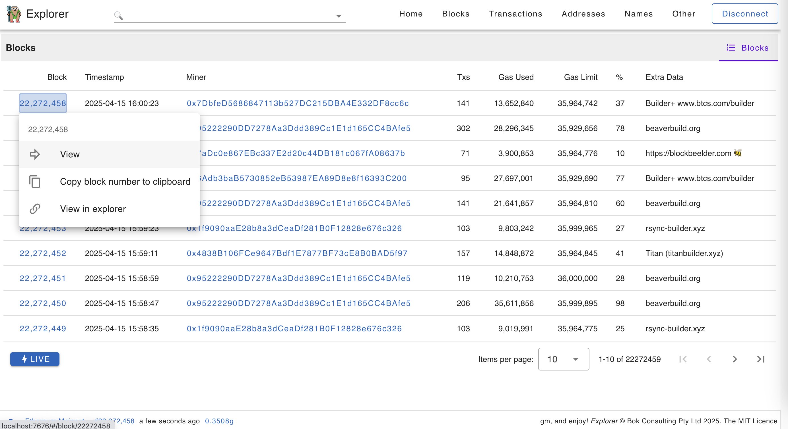
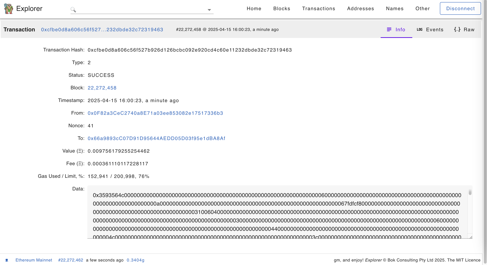
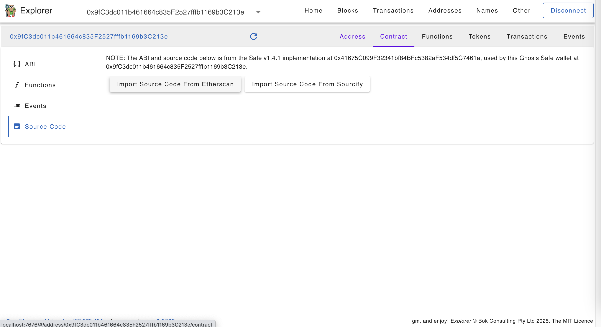
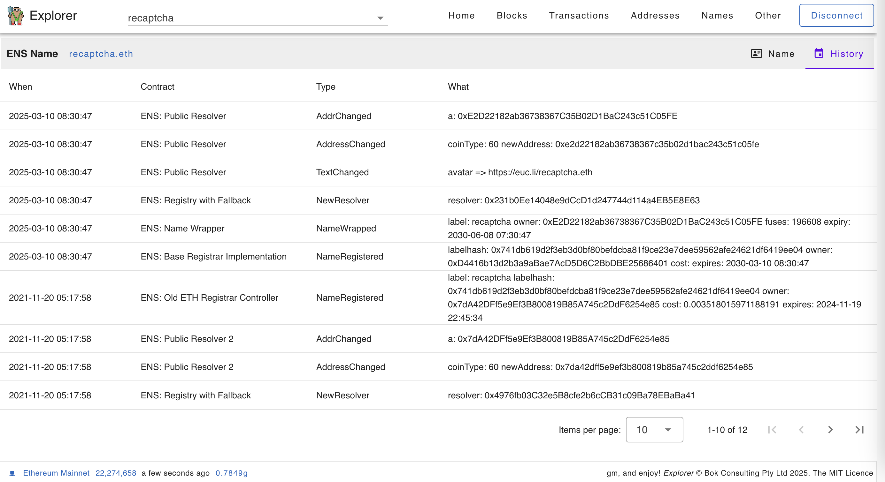

# Ethereum Explorer (WIP)

Web3 dapp: https://bokkypoobah.github.io/Explorer/ connected to Ethereum Mainnet (WIP)

 

---

### Sample Screens

#### Ethereum Mainnet

Get your free (or non-free) API key from https://etherscan.io/apis and enter in the Other -> Config page. This API key is used to import the ABI and source code for contracts, and later on transactions and internal transaction listings for addresses. We are not affiliated with Etherscan.

Click [IMPORT FROM ETHERSCAN] to import a list of EVM chains.

<kbd></kbd>

<kbd></kbd>

<kbd></kbd>

<kbd></kbd>

<kbd></kbd>

<kbd></kbd>

<kbd></kbd>

<kbd></kbd>

<kbd></kbd>

<kbd></kbd>

<kbd></kbd>

<kbd></kbd>

<kbd></kbd>

#### Base Mainnet

<kbd></kbd>

<kbd></kbd>

 

---

### Deployed Contracts For Testing

* Mar 25 2025 - Deployed [deployed_contracts/TestExplorer_v0.8.0a_Sepolia_0xFD8609Efb8A768A8ef559Cba94Ec21E7Bf8801c4.sol](deployed_contracts/TestExplorer_v0.8.0a_Sepolia_0xFD8609Efb8A768A8ef559Cba94Ec21E7Bf8801c4.sol) to Sepolia [0xfd8609efb8a768a8ef559cba94ec21e7bf8801c4](https://sepolia.etherscan.io/address/0xfd8609efb8a768a8ef559cba94ec21e7bf8801c4#code)
* Mar 30 2025 - Deployed [deployed_contracts/TestExplorer_v0.8.0b_Sepolia_0xd873a572631cD837B03218369974C26b7A82f245.sol](deployed_contracts/TestExplorer_v0.8.0b_Sepolia_0xd873a572631cD837B03218369974C26b7A82f245.sol) to Sepolia [0xd873a572631cD837B03218369974C26b7A82f245](https://sepolia.etherscan.io/address/0xd873a572631cD837B03218369974C26b7A82f245#code)

 

 

Enjoy!

(c) BokkyPooBah / Bok Consulting Pty Ltd 2025. The MIT License
